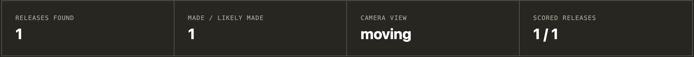
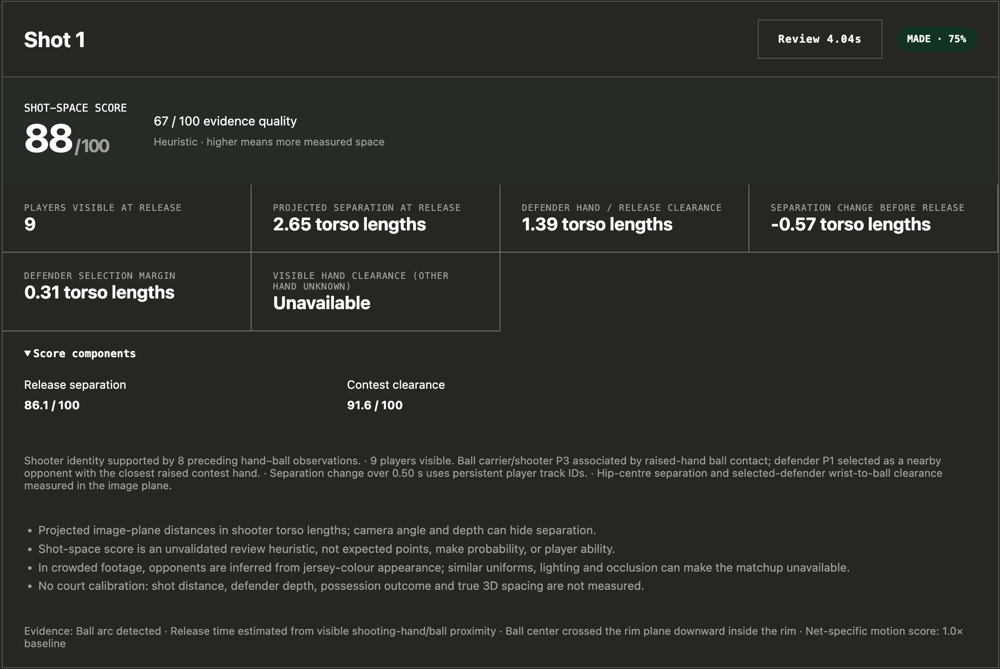

# ballform

Ballform is a basketball video analyzer for people who want more than “nice shot.”

It looks at a single shooter’s mechanics, or at the little geometry of a game possession: who had the ball, who was the primary defender, how much space existed at release, whether the contest got tighter, and whether the shot got up cleanly. It runs on your machine. Your clips do not get uploaded to somebody else’s dashboard, and there is no subscription hiding behind the demo.

The numbers are useful review signals, not a scouting department in a box. Compare clips from the same camera. Watch the annotated video. If the tracker is unsure, the report should say so.

## see it on a real clip [Full Demo](https://www.ishaanmehta.dev/projects/basketball)

<a href="https://www.youtube.com/watch?v=6gkVcpQtEcA"></a>
raw shooting clip

<a href="https://www.youtube.com/watch?v=uuiYnWBlgpQ"></a>
after ballform


simple metrics


advanced metrics

## get it running

You need Python 3.11 or 3.12 and [uv](https://docs.astral.sh/uv):

```bash
uv sync --extra dev --python 3.12
uv run uvicorn app.main:app --reload
```

Open <http://127.0.0.1:8000>. Thats it. `ffmpeg` is worth installing if you want clean H.264 review videos in the browser.

The first run downloads the pose and detection weights into `models/`. They are cached after that. Uploads, reports, observations, and rendered videos live in `data/jobs/`. Stop the server with `Ctrl+C`.

### optional speedups on Apple silicon

Both are optional. Without them everything still runs, just slower, and the results page says which one is missing.

1. **Faster ball detector** (an MLX + Metal port of the same model, about 1.7x faster per call, same results):
   ```bash
   uv pip install --python .venv/bin/python "fast-rfdetr @ git+https://github.com/ishaanzee/kernelopt"
   ```
2. **Pose on the Neural Engine** (a one-time export, about 1.5x faster per frame, with small fp16 differences):
   ```bash
   YOLO_AUTOINSTALL=False uv run --with onnx --with onnxslim --with onnxconverter-common \
       python scripts/export_pose_coreml.py yolo26s-pose yolo26m-pose
   ```

A plain `uv sync` removes the detector package again. Use `uv sync --inexact`, or rerun the install.

## getting a clip that does not sabotage the model

For form work, keep the shooting arm, ball, feet, rim, and net visible. A side view is best for release and arc; a rear-oblique view is better for alignment. 60 fps and 1080p are a good target. A phone three to six feet high is usually enough. Do not digitally zoom halfway through the possession.

For game footage, short continuous half-court possessions are the sweet spot. NBA skycam and elevated pickup clips are supported, but replays, cuts, graphics, extreme zooms, and a rim that disappears behind the broadcast edit are still hard problems. A five-on-five clip is fine even when the UI says 1-on-1; the analyzer still tries to identify the ball carrier and the primary contesting defender.

Moving-broadcast game footage needs no court marking. The basketball detector labels players, referees and everyone else, and each detected player or referee box can vouch for only one pose. A spectator or duplicate pose overlapping a real player therefore cannot pass as a player. A playing-area polygon is optional and only offered for fixed cameras (elevated or courtside). If you draw one, keep it convex and cover the playable area, not the benches. A foot within about a body width of the edge still counts, so a player standing on the line is kept. Moving-camera analyses ignore a polygon: it is fixed in image coordinates, so it cannot follow a pan, and on test clips it cut a player standing on the sideline in roughly 10% of player detections. People standing just off the court can still pass as players when the detector calls them players, for example a bench player in warmups on the baseline.

## camera choices

There are three camera profiles. `Stationary courtside` is the default.

`Stationary courtside` is the cleanest choice when you want make/miss.

The rim no longer needs marking. In game mode, the basketball detector's rim class finds a snug box around the hoop ring on every frame, whatever the camera profile. The frames are linked into one hoop per camera segment, one-off false detections are dropped, and jitter is smoothed with a local line fit. It restarts after camera cuts. On four test clips it found the rim on every game frame. It called all four shots made, which close-ups of the ball passing through the net confirm; three of them previously had no outcome at all. Form mode samples about 15 frames and uses the median box. Dragging a box in the preview still overrides the detection: it is fixed on stationary cameras and tracked from that frame on a moving one. Reports say whether the rim was `detected` or `marked` under `diagnostics.rim_source`. Two limits: if both hoops are visible, the one detected more strongly is used, so mark the rim if the wrong hoop is chosen; and the form-mode sampling has not yet been tested on a stationary single-shooter clip.

`Pickup / elevated wide view` is for a fixed, wide, elevated camera. It tracks players and the ball, and reports make/miss when the rim is detected or marked.

`Moving broadcast + tracked rim` is the profile for NBA and other broadcast footage, meaning a continuous pan or moderate zoom. The detected rim follows the hoop through pans, zooms and cuts. It can score the rim crossing, use net motion as supporting evidence, and place the green make pulse over the moving hoop. If you mark the rim instead, a local CSRT tracker follows your box forward and backward from that frame; a hard cut, a lost track or an implausible jump then ends outcome scoring rather than producing a confident-looking lie.

The make classifier wants a visible downward crossing through the rim. If the ball vanishes at the hoop, it can call a **likely make** only when the descending path projects through the rim and localized net motion arrives afterward. Net movement by itself never turns an airball into a make. Green animation means the analyzer found a verified or likely make; it is not a broadcast replay graphic.

## what game mode actually measures

The game pass uses multi-person pose detection, a basketball-trained detector, motion and jersey appearance to keep track of people. It chooses a shooter from recent hand/ball contact and release evidence, then chooses the nearest plausible opposing contest. Persistent IDs make the pre-release comparison less random, but crowded frames, similar jerseys, tiny players, officials, and occlusion can still break identity.

The shot-space score is deliberately transparent:

```text
65% separation score + 35% contest-clearance score
```

Separation is projected hip-to-hip distance in shooter torso lengths. Contest clearance is projected ball-to-defender-wrist distance in the same units. Separation change is reported as context, not secretly folded into the grade. It compares the release separation with the median over 0.3–0.7s before release. It relies on persistent player identities, so it needs both players tracked on at least half the frames through release. Each earlier frame is rescaled by the camera's zoom, estimated from every player seen in both frames. Frames zoomed by more than about 20% are skipped. One player crouching or turning no longer voids it, and neither does a camera pan. Each defender hand is measured on the frame nearest release, within 0.1s, where both that hand and the ball are visible. A hand briefly hidden on the release frame therefore no longer turns the contest into a range, and the confidence drops with the time offset. Only a hand unseen for that whole window leaves the score as a range with "other hand unknown". The score is a 0–100 review heuristic, not make probability, expected points, or a professional player grade. Missing evidence stays missing; it does not become a zero.

### which shots game mode finds

Each game shot is labelled jump shot, floater, layup, dunk, "layup or dunk" or tip, and its evidence says why (`app/shots.py`).

- **Jump shots** still need a ball arc, raised-hand ball contact at release and a flight well above the release shoulders. When the release itself is hidden, the basketball detector's jump-shot class plus a supported arc also counts. The release time is then the last visible hand contact, and the evidence says so.
- **Floaters** are arc shots where the detector's layup-dunk class is at least as confident as its jump-shot class around release.
- **Layups, dunks, tips and putbacks** need a player's hand on the ball, then the ball reaching the basket within 1.2 s. "Reaching the basket" means a confident ball-in-basket detection, or the ball entering the rim's area when a rim exists. A dunk's last contact is at or above the basket. A tip is a raised-hand touch at the rim after the previous attempt got there. Without a rim or a basket detection, the detector's layup-dunk class plus the ball leaving the hands upward, above the head, gives "layup or dunk".
- **One attempt is one hand contact followed by the ball reaching the basket.** A ball rattling on the rim, or a rebound, has no new contact, so it belongs to the previous shot. A dribble has to leave the hands upward without bouncing. A pass that never reaches the basket is not a shot. A shot in flight claims its own arrival at the basket, so a hand touching it on the way (a contest, or a fan's hand the ball passes over in 2D) does not start a new attempt. A contact where the ball stays on one parabola through the "touch" is ignored for the same reason.
- **The shooter** for these attempts is the last player in unambiguous hand contact. It is checked against the decoded ball handler, and withheld when the two disagree (except for tips).
- **Ball-in-basket detections are never a make on their own.** Lone low-confidence detections also fired on an empty net. With a rim, the outcome uses the same rim-plane crossing and net-motion rules as jump shots. A ball-in-basket detection plus net motion can raise an otherwise-unknown rim attempt to "likely made".

**Scoring rim attempts.** Separation at the finish says little about a dunk, so layups, dunks and tips get a contest-only score: 100 × the contest-clearance component, measured at the last hand contact. Separation at the gather (the median over 0.3–0.7 s before that contact) is reported but not scored. These scores are labelled in the report and kept out of the mean shot-space score. Hidden-release jump shots use the normal score.

**Validation so far.** On the four one-jump-shot test clips, each still gives exactly its one jump shot, with the same release, shooter, defender, score and outcome. The new paths are covered by unit tests on synthetic tracks: layup, dunk, tip, putback, rim rattle, rebound, dribble, pass, mid-flight contest and hidden release. With the automatically detected rim, the rim-area path first found two false attempts on `2fcb`: a "dunk" and then a "tip". Both were the made jump shot falling past raised hands of fans behind the baseline. The flight and parabola rules above remove them. None of this has been checked on real layup, dunk, floater or putback footage, so treat the thresholds as untuned. The parabola tolerance (2.5 ball radii) rests on only three real releases and two pass-overs.

Form mode reports 2D image-plane estimates such as release timing, launch angle, elbow angle, and upper-arm elevation. These are good for comparing your own reps from the same setup. They are not calibrated 3D biomechanics.

## court calibration (optional, for feet)

Game analyses can report real floor distances. In the preview, choose **Calibrate court**, pick the court standard (NBA, FIBA, NCAA or high school), scrub to a frame where the floor lines are clear, then pair landmarks: pick one on the half-court diagram and click the same spot on the video, where the painted lines meet. The page draws the fitted court over the frame so you can check it before analyzing.

Mark five or more landmarks spread over the floor. Four always fit exactly, so their error cannot be checked; from five, the page also shows how far each point moves when it is left out. Include one far from the basket when you can, such as where the half-court line meets a sideline. On a test broadcast, six clicks bunched around the lane agreed within 2 px but put half court about 2.5 ft away from where a fit including a half-court click did. Spots inside the arc moved by under 1 ft. Reports say when a shot was taken outside the marked area, because its position is then extrapolated.

The floor mapping is a homography, so it is valid only for points on the floor. The ball and the rim are never mapped through it. On moving cameras it follows pans and zooms from floor features only: the court under the current mapping plus a 6 ft apron, minus every player (and their floor reflection) and minus static broadcast graphics. The chain runs forward and backward from the marked frame and stops at camera cuts or when too few floor features survive. Frames it cannot map are marked unreliable and get no measurements in feet. Fixed cameras (courtside and elevated) keep the marked mapping. The review video draws the court lines on every reliably mapped frame.

What it adds next to the torso-length metrics, which are unchanged:

- **Shot distance** from the shooter's floor spot to the floor point under the rim, which comes from the court template. Shooters are usually airborne at release, and airborne feet map to a point beyond the player, so the spot comes from the ankles on the last grounded frames before take-off. The report says which frames were used.
- **Shot zone** (paint, midrange, corner three, above-the-break three), the shooter's court position, and how far the spot is behind or inside the three-point line.
- **Floor separation** from the shooter's take-off spot to the defender's feet.
- **Contest clearance in feet**, which is approximate. It assumes the defender's hand and the ball are at the shooter's depth, and uses the camera recovered from the floor mapping.

Player positions use the midpoint of the visible ankles, or the bottom of the pose box when both are hidden (reported as such). What was checked, on four broadcast clips with hand-placed landmarks:

- **Fit:** 1.4–3.5 px RMS error on the clicked points. Unclicked landmarks, such as the 28 ft coaching-box line, reprojected within 3 px.
- **Drift:** projected lane lines stayed within 2 px of the paint through the shot on every clip, and within about 7 px to the end of each clip. The worst case was one clip's baseline, about 16 px off at the end.
- **Known distances:** lane width mapped to 15.6 ft (true 16) and the baseline-to-free-throw distance to 18.8 ft (true 19), on the anchor frame and 140 frames later alike.
- **Consistency:** two different broadcast edits of the same shot, calibrated separately, gave 24.9 and 24.8 ft.

Mapped positions move smoothly overall, but about 3% of frame-to-frame steps jump by more than a player can run, from lifted feet and ankle jitter. They are fine for spots and spacing, not for speeds. There are no hand-labelled ground-truth distances yet.

## phone upload, still local

If the clip is on an iPhone, install [Tailscale for macOS](https://tailscale.com/download/mac) and [Tailscale for iOS](https://tailscale.com/download/ios), sign into the same account, then run:

```bash
uv run ballform-share --network tailscale
```

Scan the QR code in the terminal with the iPhone camera. Safari opens a private pairing link to the Mac. The video still runs on the Mac and stays on the Mac; Tailscale is only the encrypted pipe. Keep the terminal and Tailscale open while uploading. `--network lan` is available if both devices are on the same Wi-Fi. The older `ballform-lan` command remains available.

## models, memory, and reality

Game mode defaults to YOLO26s-pose and offers YOLO26m-pose in the model selector. YOLO26s was about 11% faster on the current 10-second sample, with similar shot detection; compare more clips before treating that as a general result. Only one analysis runs at a time. Game analysis also uses overlapping wide-view crops and a basketball-trained RF-DETR Medium detector. The full-frame pose view and both side crops retain their original input sizes; no frames or crop views are skipped. When side-crop ball detection is needed, it runs alongside pose inference. The app is intended for Apple silicon with 36 GB RAM (16 GB should work with smaller clips). The downloaded JSON report now breaks out pose, ball, rim tracking, frame processing, review-overlay, and encoding times. Pose and ball times are subsets of frame processing and can overlap, so do not add them to the total. Wide-view analysis is offline processing, not real-time playback.

On Apple-silicon Macs, the basketball detector now uses ONNX Runtime's Core ML provider by default, running it on CPU + GPU (`MLComputeUnits=CPUAndGPU`) without INT8 quantization or changing the input size. This transformer ran about 2.6x faster per call on the GPU than on the Neural Engine (46 ms vs 119 ms on an M3 Pro). On the 10-second moving-broadcast sample, the whole analysis took 80.1s versus 98.5s with CPU + Neural Engine, with an identical shot result; frame processing fell from 56.9s to 45.8s. `ALL` processed frames about as fast but took 46s instead of 25s to load. Set `BALLFORM_COREML_UNITS` to `ALL`, `CPUAndNeuralEngine` or `CPUOnly` to compare; each setting keeps its own cache. Other systems use CPU, and an automatic Core ML initialization or inference failure falls back to CPU. To force the previous path, start the app with `BALLFORM_BALL_BACKEND=cpu uv run uvicorn app.main:app --reload`; `BALLFORM_BALL_BACKEND=coreml` explicitly requests Core ML and fails rather than falling back. The report records the requested and actual backend. The first run compiles a cache under `models/coreml-cache/` and can take longer to start; later runs reuse it. Core ML may still leave some operations on CPU. The detector can be compared on every frame and crop with `uv run python scripts/benchmark_ball_backends.py /path/to/clip.mp4`. On the current 10-second sample, the cached Core ML run took 101.82s versus 172.68s with CPU, with identical shot and diagnostic report fields; compare more clips before generalizing that result.

The fastest basketball detector is an optional MLX + Metal port of the same RF-DETR model: `fast_rfdetr`, from the companion [kernelopt](https://github.com/ishaanzee/kernelopt) project. Install it into this environment with:

```bash
uv pip install --python .venv/bin/python "fast-rfdetr @ git+https://github.com/ishaanzee/kernelopt"
```

If you work on `kernelopt` yourself, install your checkout instead with `-e ../kernelopt`.

When it is installed, `BALLFORM_BALL_BACKEND=auto` (the default) uses it on Apple silicon. The two side crops of a frame run as one batched GPU call. Set `BALLFORM_BALL_BACKEND=coreml` to use ONNX Runtime + Core ML instead, or `mlx` to require the port. If the package is missing or fails, `auto` falls back to Core ML and records why in `vision.ball_backend_fallback`.

The port is a pure speedup. On four test clips, its ball detections, possession boxes, players, ball handler and shot results were identical to the Core ML path. It matched all 1082 confident objects on 120 other frames. Per call it takes 28.5 ms versus 48.4 ms, and the two side crops take 54.5 ms together versus 96.8 ms. End to end, analyses were 13–29% faster, and waits on side-crop detection fell from 5–9 s per clip to under 0.6 s.

Two caveats:
- A plain `uv sync` removes packages that are not in the lockfile. Use `uv sync --inexact`, or rerun the install command above. Otherwise analyses quietly fall back to Core ML.
- The port reproduces this environment's `cv2.resize` bit for bit (OpenCV 4.14 with KleidiCV on arm64). Changing the OpenCV build changes the golden preprocessing.

On a Mac using MPS pose and the Core ML basketball detector, game mode now keeps one additional frame in flight. A second detector session examines the next frame while the current frame's pose, tracking, and annotation finish; tracking and scoring still consume frames in source order. This preserves the full input resolution and analyzed frame rate. Set `BALLFORM_FRAME_PIPELINE=1` when starting the server to disable the overlap, or `BALLFORM_FRAME_PIPELINE=2` to request it explicitly. The report records the actual pipeline depth and any fallback. On the same 10-second moving-broadcast clip, the two-frame pipeline took 83.50s versus 102.48s with one frame; both runs produced identical observation files and shot results. More in-flight frames are not automatically faster because detector calls can contend for the same compute hardware.

The server loads the game pose model and both detector sessions once and reuses them for every job, instead of reloading them per analysis; Core ML otherwise spends about 12s preparing each detector session on every load. On startup it preloads and warms the default models in the background (about 10s); a job submitted during that time waits until preloading finishes. On the 10-second sample this cut a job from 80.1s to about 55s with identical observations. Set `BALLFORM_PRELOAD=0` to load models on the first job instead. Each report lists any models loaded during that job under `vision.models_loaded_this_job`.

Game pose can run on the Neural Engine while the basketball detector uses the GPU. Export the pose weights once:

```bash
YOLO_AUTOINSTALL=False uv run --with onnx --with onnxslim --with onnxconverter-common \
    python scripts/export_pose_coreml.py yolo26s-pose yolo26m-pose
```

This writes fixed-shape fp16 ONNX files to `models/`, which the app then uses automatically. fp16 matters: the Neural Engine only runs fp16 programs, and an fp32 model silently runs on the CPU at about the same speed as CPU-only. The exports fit 16:9 footage. Other aspect ratios keep using PyTorch pose call by call, so every input matches the original preprocessing. On the 10-second sample, frame processing fell from 45.0s to 30.0s and the job from 54.0s to 38.9s. The shot, make frame, shooter and defender were unchanged. fp16 keypoints moved the shot-space score from 97.9 to 97.4 (separation 2.997 vs 2.977 torso lengths) and changed which track ID labelled the same ball handler on 18 end-of-clip frames. Set `BALLFORM_POSE_BACKEND=torch` to use PyTorch/MPS pose, or `coreml` to fail rather than fall back. Reports record `vision.pose_backend` and any fallback.

The ball-handler highlight is decoded after all frames are analyzed rather than frame by frame. Each tracked player, plus "nobody", is scored on every frame from wrist contact with the ball, a low ball beside the body (mid-dribble), and the basketball detector's player-in-possession class. The most consistent sequence over the whole clip wins (`app/possession.py`). Keeping a handler is free. Picking up a loose ball is cheap, so a catch-and-shoot still registers. Taking the ball from another player costs more, so a few frames of a defender's hand near the ball do not relabel the dribbler. Future frames also let passes switch on the catch, and the handler ends while a shot or pass is in flight. `observations.json` keeps the previous frame-by-frame result as `handler_online`, and `BALLFORM_HANDLER=online` restores it for the review video.

Wrist contact counts in full only when the ball is within about 0.4 torso lengths of a wrist, and fades to nothing at 0.9. A loose ball bouncing past a player's hand in the image, such as after a make, therefore no longer reads as possession. When two hands are near the ball, the clearly closer one takes the credit. Players the detector sees but pose estimation misses, usually because a teammate or defender hides them, also compete for the ball. When one of them is holding it, the highlight shows nobody rather than moving to the visible neighbour.

After all frames are analyzed, player tracks are stitched within each camera segment. The frame-by-frame tracker can split one player into several IDs when the ball or arms hide the jersey colour it matches on, or when the player crouches. Two fragments join when they never appear on the same frame and every switch between them is a short, plausible continuation: at most 0.5s, a small jump and a similar body scale. Stitching is deliberately conservative. A missed join leaves a duplicate label, but a wrong one would swap two players. Player labels in the review video are drawn after stitching, and reports record the count under `diagnostics.tracks_stitched`. A camera cut is confirmed one sampled frame late, so the cut's first frame is now re-tracked with fresh IDs instead of carrying the previous shot's.

You can experiment with other local Ultralytics checkpoints:

```bash
export BALLFORM_YOLO_MODEL=/path/to/model.pt
```

The replacement ball model needs COCO class 32 (`sports ball`). A bigger generic checkpoint is not automatically better on NBA broadcasts or pickup footage, so compare its annotated output before trusting it.

## limits worth knowing before you trust a number

Camera movement changes apparent distances. Jerseys can look alike. Players overlap. A ball can be hidden for exactly the frames that matter. Passes and slow-motion edits can resemble shots. Cuts reset tracking. The analyzer reports evidence and confidence, but this project has not been calibrated against a labeled NBA shot-outcome dataset. Treat it like a sharp review assistant, not an oracle.

## code map

`app/analyzer.py` handles decoding, inference, tracking, net flow, and annotated video. `app/scoring.py` segments arcs and computes form/outcome evidence. `app/shots.py` adds hidden-release jump shots and rim attempts and labels shot types. `app/game.py` handles shooter/defender association and the shot-space score. `app/court.py` holds the court templates, the landmark fit and floor geometry; `app/camera_motion.py` follows the floor mapping through camera motion. `app/tracking.py` owns multi-player IDs and jersey descriptors. `app/vision.py` handles wide-view detection, crops, court filtering, and cuts. `app/main.py` is the local upload/job API. `app/lan.py` handles the tokenized LAN/Tailscale link.

Run the checks with:

```bash
uv run pytest -q
node --check web/app.js
node --check web/court.js
```

Ballform is AGPL-3.0-only because it integrates the AGPL-licensed Ultralytics package and model. MediaPipe is Apache-2.0. See `LICENSE`, `NOTICE.md`, `CONTRIBUTING.md`, and `SECURITY.md` before distributing a modified service.
