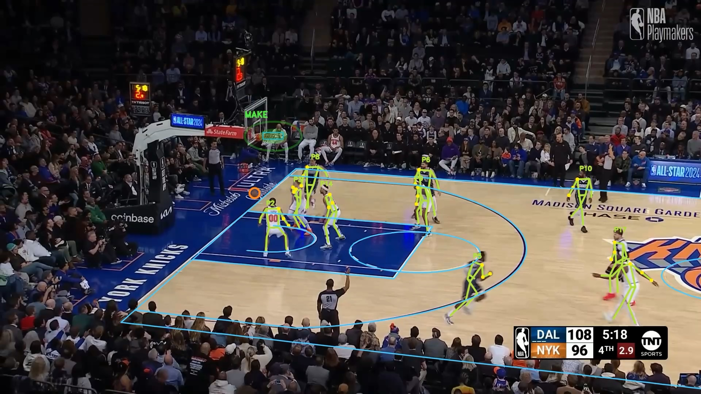
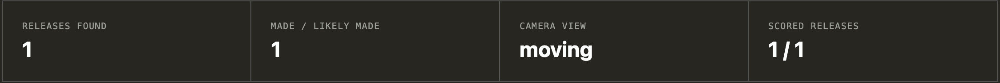
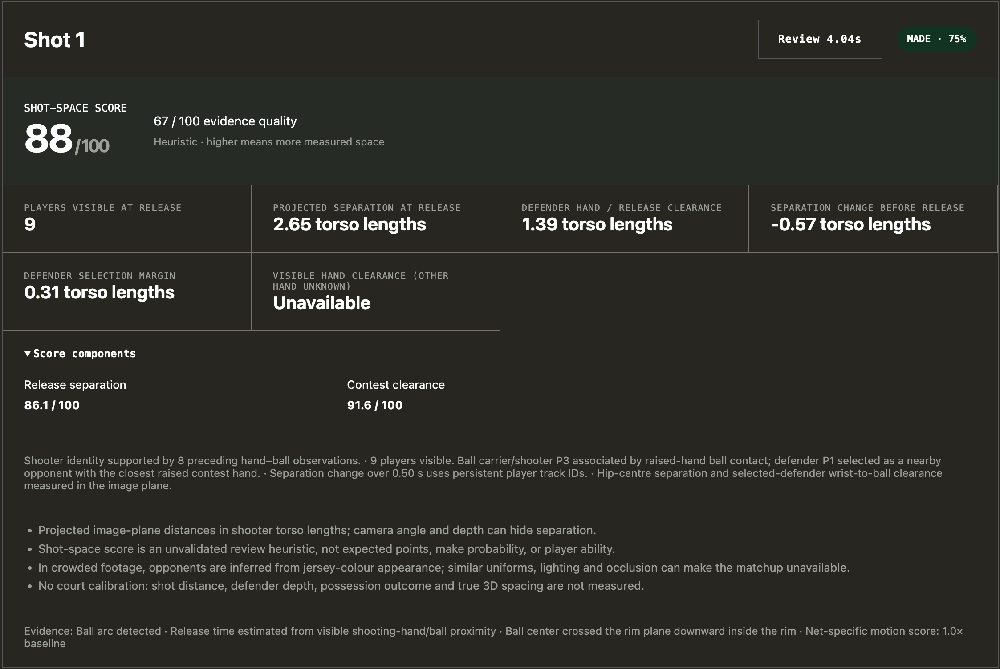

# ballform

A basketball video analyzer that runs on your machine. It looks at a single shooter's mechanics, or at the geometry of a game possession: who had the ball, who the primary defender was, how much space there was at release, and whether the shot went in.

The numbers are review signals, not a scouting department in a box. Compare clips from the same camera, watch the annotated video, and if the tracker is unsure the report says so.

## demo

[Full demo](https://www.ishaanmehta.dev/projects/basketball)


*game review with court calibration*

| simple metrics | advanced metrics |
|---|---|
|  |  |

## what it does

- **Tracks players and the ball** with multi-person pose, a basketball-trained RF-DETR detector, motion and jersey appearance.
- **Finds the rim by itself**, follows it through pans, zooms and cuts, and calls makes from the rim crossing plus net motion.
- **Picks the shooter and the nearest contesting defender**, then scores the shot with a transparent formula: 65% separation + 35% contest clearance.
- **Labels shot types**: jump shot, floater, layup, dunk, tip.
- **Court calibration** maps the floor so distances, zones and spacing come out in feet. On broadcast footage it is found automatically from the whole clip; you can also mark or adjust the court landmarks yourself.
- **Form mode** reports 2D release timing, launch angle, elbow angle and upper-arm elevation for comparing your own reps.
- **Annotated review video** with tracking, court lines and a pulse on makes.

Everything runs locally. Clips and reports stay in `data/jobs/`.

## run it

Python 3.11 or 3.12 and [uv](https://docs.astral.sh/uv):

```bash
uv sync --extra dev --python 3.12
uv run uvicorn app.main:app --reload
```

Open <http://127.0.0.1:8000>. The first run downloads the pose and detection weights into `models/`. `ffmpeg` is worth installing for clean H.264 review videos; on a Mac it uses the hardware encoder.

### faster on Apple silicon (optional)

Both speedups are optional. Without them everything still runs, just slower, and the results page says which one is missing.

**Faster ball detector.** An MLX + Metal port of the same model from [kernelopt](https://github.com/ishaanzee/kernelopt), 28.5 ms per call versus 48.4 ms, with identical detections.

```bash
uv pip install --python .venv/bin/python "fast-rfdetr @ git+https://github.com/ishaanzee/kernelopt"
```

**Pose on the Neural Engine.** A one-time export, about 1.5x faster per frame, with small fp16 differences.

```bash
YOLO_AUTOINSTALL=False uv run --with onnx --with onnxslim --with onnxconverter-common \
    python scripts/export_pose_coreml.py yolo26s-pose yolo26m-pose
```

A plain `uv sync` removes the detector package again. Use `uv sync --inexact`, or rerun the install.

### upload from an iPhone

Install Tailscale on the Mac and the iPhone, sign into the same account, then:

```bash
uv run ballform-share --network tailscale
```

Scan the QR code with the iPhone camera. The video still runs on the Mac; Tailscale is only the encrypted pipe. Use `--network lan` if both devices are on the same Wi-Fi.

## picking a camera profile

| profile | use it for |
|---|---|
| `Stationary courtside` (default) | fixed camera at court level, cleanest make/miss |
| `Pickup / elevated wide view` | fixed, wide, elevated camera |
| `Moving broadcast + tracked rim` | NBA and other broadcast footage with pans and zooms |

Tips for a good clip: keep the shooter, ball and rim visible, shoot at 60 fps and 1080p, and don't digitally zoom mid-possession. Short continuous half-court possessions work best. More in [docs/cameras-and-clips.md](docs/cameras-and-clips.md).

## how it works

Deeper write-ups, with the measurements behind them:

- [Game mode](docs/game-mode.md): the shot-space score, shot-type rules, validation
- [Court calibration](docs/court-calibration.md): homography fit, auto-detect, whole-clip calibration, floor trajectories, accuracy checks
- [Performance](docs/performance.md): model backends, pipelining, review video encoding, timings
- [Cameras and clips](docs/cameras-and-clips.md): profiles, rim detection, make classifier

## limits

Camera movement changes apparent distances. Jerseys can look alike. Players overlap. The ball can be hidden for exactly the frames that matter. Passes and slow-motion edits can resemble shots. Cuts reset tracking. On held-out NBA broadcast clips it finds 72% of shots, 90% of its shots are real, and its make/miss calls are right 95% of the time ([measured accuracy](docs/game-mode.md#measured-accuracy)); pickup and gym footage has not been labeled yet. Treat it as a review assistant, not an oracle.

## code map

| file | job |
|---|---|
| `app/analyzer.py` | decoding, inference, tracking, net flow, annotated video |
| `app/scoring.py` | arc segmentation, form and outcome evidence |
| `app/shots.py` | hidden-release jump shots, rim attempts, shot types |
| `app/game.py` | shooter/defender association, shot-space score |
| `app/court.py`, `court_detect.py`, `camera_motion.py`, `trajectory.py` | court templates and fit, auto-detect, camera motion, floor trajectories |
| `app/tracking.py` | multi-player IDs and jersey descriptors |
| `app/vision.py` | wide-view detection, crops, court filtering, cuts |
| `app/main.py` | local upload/job API |

## tests

```bash
uv run pytest -q
node --check web/app.js
node --check web/court.js
```

## license

AGPL-3.0-only, because it integrates the AGPL-licensed Ultralytics package and model. MediaPipe is Apache-2.0. See `LICENSE`, `NOTICE.md`, `CONTRIBUTING.md` and `SECURITY.md` before distributing a modified service.
